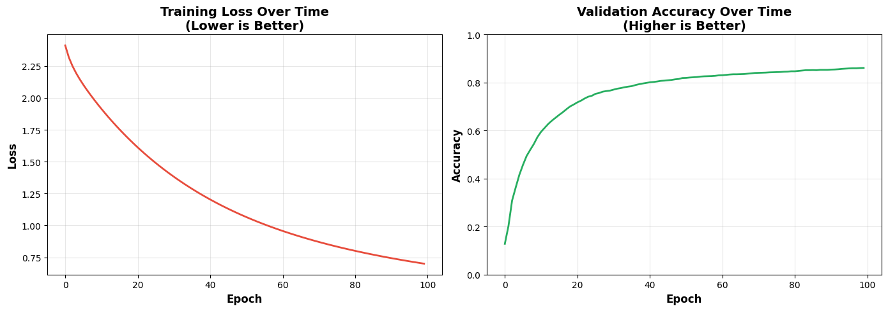
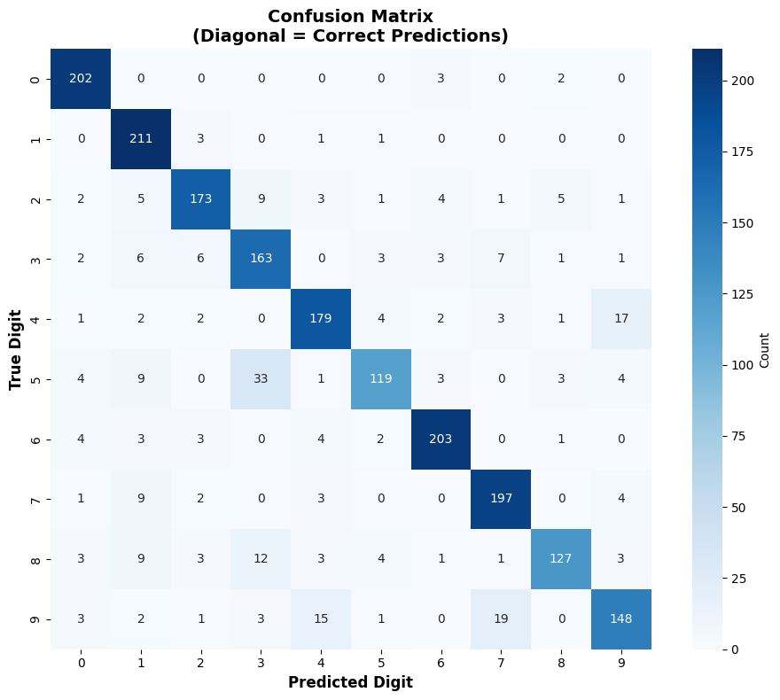
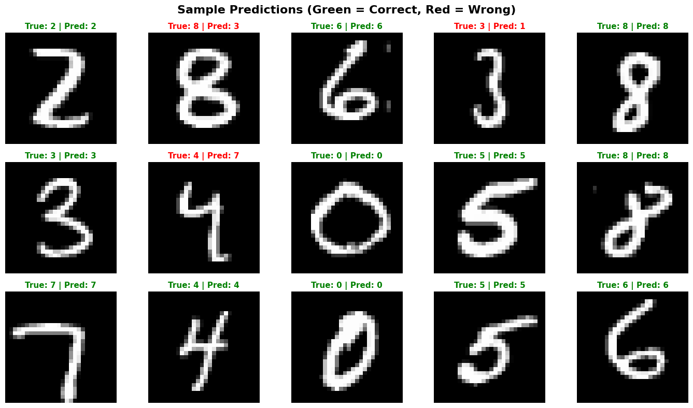
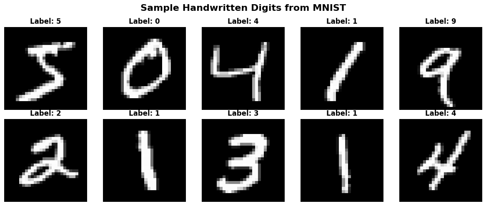

# Handwritten Digit Recognition — Artificial Neural Network from Scratch using NumPy

An artificial neural network built **using only NumPy** — no PyTorch, TensorFlow, or Keras — that learns to read handwritten digits (0 through 9) from the MNIST dataset. Every part of the network, including the backpropagation learning algorithm, is written by hand to show exactly how a neural network works under the hood.

## What is MNIST?

MNIST is one of the most famous datasets in machine learning — often called the "Hello World" of deep learning. It contains **70,000 images of handwritten digits** (0–9), each written by a different person and scanned into a small **28×28 pixel** grayscale image. Because the handwriting comes from thousands of different people, the digits vary in shape, thickness, and style, making it a great test of whether a model can learn to recognize patterns the way humans do.

## How the Code Works — Step by Step

### Step 1: Data Loading
Loads 70,000 handwritten digit images from MNIST. These are the examples the network learns from — like collecting flashcards before studying.

### Step 2: Data Visualization
Displays a few sample images so we can see what the data actually looks like before training begins.
**Output:** `mnist_samples.png` — 10 example digits

### Step 3: Data Preparation
- **Splitting:** 80% of the data is used for training (teaching the network) and 20% for testing (the final exam on unseen digits)
- **Standardization:** Pixel values are rescaled so the network trains in a stable, consistent range
- **Why:** Clean, well-scaled data makes the math easier and helps the network learn faster

### Step 4: Neural Network Architecture
The network has three layers:
- **Input Layer (784 neurons):** one neuron for each pixel in the 28×28 image
- **Hidden Layer (128 neurons):** detects patterns like edges, curves, and loops
- **Output Layer (10 neurons):** one neuron per digit (0–9), giving the final prediction

**Key functions, explained simply:**
| Function | What it does |
|----------|--------------|
| `sigmoid()` | Squashes numbers into a 0–1 range, like a dimmer switch |
| `softmax()` | Converts outputs into probabilities that add up to 100% |
| `forward()` | Passes an image through the network to make a prediction |
| `backward()` | Learns from mistakes by adjusting the weights (backpropagation) |

### Step 5: Training Process
Learning happens by repetition:
1. Show the network an image
2. The network makes a guess
3. Compare the guess with the correct answer
4. Adjust the internal weights to reduce the error
5. Repeat for 100 epochs across all training examples

### Step 6: Evaluation
Tests the network on images it has **never seen before**, calculates the accuracy, and produces a per-digit breakdown of precision, recall, and F1-score.

### Step 7: Visualizations
The code generates four images:
| File | What it shows |
|------|---------------|
| `mnist_samples.png` | Original handwritten digits from the dataset |
| `training_progress.png` | Loss decreasing and accuracy increasing over epochs |
| `confusion_matrix.png` | Which digits the network confuses with each other |
| `sample_predictions.png` | Example predictions (green = correct, red = wrong) |

## Architecture at a Glance
**Layer-by-layer breakdown:**

| Layer | Size | Activation | Role |
|-------|------|------------|------|
| Input | 784 | — | Flattened 28×28 pixel image (one value per pixel) |
| Hidden | 128 | Sigmoid | Learns intermediate features like edges, strokes, and curves |
| Output | 10 | Softmax | Produces a probability for each digit class (0–9) |

**Weights and parameters:**
- `W1` (784 × 128) and `b1` (1 × 128) connect the input to the hidden layer
- `W2` (128 × 10) and `b2` (1 × 10) connect the hidden layer to the output
- Weights are initialized with small random values scaled by 1/√(layer size) — this keeps the sigmoid activations in a healthy range and prevents the network from stalling early in training
- Total learnable parameters: ~101,000

**The forward pass** computes, in order: 
   
    z1 = X · W1 + b1        →   a1 = sigmoid(z1)
    z2 = a1 · W2 + b2       →   a2 = softmax(z2)
    
**The backward pass** applies the chain rule to compute gradients at each layer: 
   
    dz2 = a2 − y_true                    (output error)
    dz1 = (dz2 · W2ᵀ) ⊙ sigmoid'(a1)     (hidden error)
  and then updates every weight and bias using gradient descent:
    
     W ← W − learning_rate · dW
     
Everything — the forward pass, backpropagation, and weight updates — is coded manually with NumPy. There is no autograd or ML framework doing the math; the gradients are derived and implemented by hand using the chain rule. This is the core of what makes the project a genuine "from scratch" implementation.

## Training Setup

| Setting | Value |
|---------|-------|
| Architecture | 784 → 128 → 10 |
| Hidden activation | Sigmoid |
| Output activation | Softmax |
| Loss | Cross-entropy |
| Learning rate | 0.1 |
| Epochs | 100 |
| Training samples | 8,000 |

## Results

The network reaches **86% accuracy** on the test set — correctly identifying about 86 out of every 100 handwritten digits it has never seen. The emphasis of this project is on understanding and implementing the mechanics of a neural network by hand — deriving backpropagation from the chain rule — rather than on maximizing accuracy. (A framework-based version with ReLU activations and the Adam optimizer would reach ~97%, but would hide the very internals this project was built to expose.)

Per-digit performance is strongest for visually distinct digits (0, 1, 6) and weakest where shapes overlap (e.g. 5 confused with 6), which is exactly what you'd expect from a simple single-hidden-layer network.

### Training Progress


### Confusion Matrix


### Sample Predictions


### Dataset Samples


## Tech Stack

- **Python** — core language for the whole project
- **NumPy** — implements all the network math by hand: matrix operations, sigmoid/softmax, forward pass, backpropagation, and weight updates
- **scikit-learn** — used only to load MNIST, split the data, standardize pixels, and compute evaluation metrics
- **Matplotlib** — plots the training curves and sample digits
- **Seaborn** — renders the confusion matrix as a readable heatmap

## How to Run

```bash
pip install numpy scikit-learn matplotlib seaborn
python ann_mnist.py
```

## Why I Built This

I wanted to truly understand how neural networks learn, not just call a library function. Deriving and coding backpropagation by hand gave me a solid foundation in the mechanics of training — knowledge that later supported my work in reinforcement learning, where understanding how models learn from feedback signals is essential.
